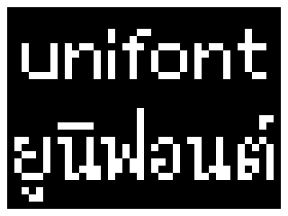
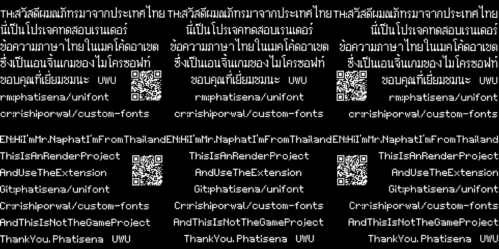

## Acknowledgements
This project includes code from the `arcade-sprite-data` extension, developed by [microsoft]. 
- Repository: [https://github.com/microsoft/arcade-sprite-data]
- License: [MIT License]

> You can view the extension owner's credits at [credit.md](CREDIT.md)

> Open this page at [https://phatisena.github.io/unifont/](https://phatisena.github.io/unifont/)

> download the arcade extension file at [arcade-unifont-uf2](arcade-unifont.uf2)

> This extension has a guide to import, which can be found at [file-import-guide](IMPORT_GUIDE.md)

# Extension Highlight

This extension highlight is a rough outline but can be viewed at [extension-hightlight](HIGHTLIGHT.md)
